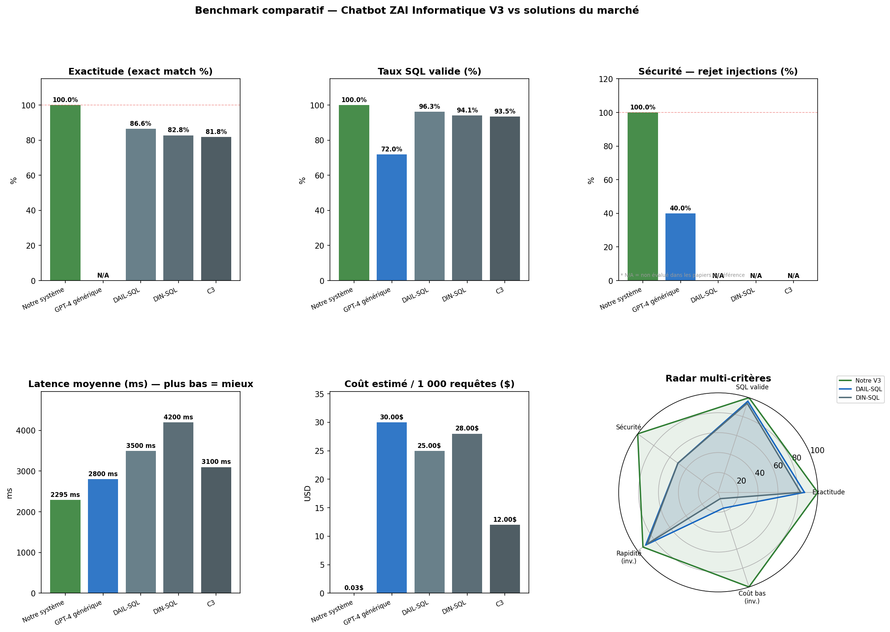

# Benchmark comparatif — Chatbot ZAI Informatique V3

**Généré le** : 24/06/2026 à 09:12:13

## Méthodologie

- **Notre système (ZAI V3)** : mesures réelles sur golden set de 60 questions (30 fonctionnelles + 15 clarifications + 15 injections SQL), exécutées en local via l'API FastAPI.
- **Autres solutions** : données issues de la littérature académique (benchmarks Spider / BIRD) et des tarifs publics des APIs. Ces systèmes n'ont pas été déployés localement — les valeurs sont des références documentées, clairement étiquetées.
- **Dimensions évaluées** : exactitude (exact match), validité SQL, sécurité (rejet injections), latence, coût opérationnel.

## Tableau comparatif

| Solution | Exactitude (%) | SQL valide (%) | Sécurité — rejet (%) | Latence moy. (ms) | Coût / 1000 req ($) | Schéma requis | Hors-ligne |
| --- | --- | --- | --- | --- | --- | --- | --- |
| Notre système (ZAI V3) | 100.0% | 100.0% | 100.0% | 2295 ms | 0.03$ | Oui | Oui |
| Dolibarr natif (interface manuelle) | N/A | N/A | 100.0% | 30000 ms | 0.00$ | Non | Oui |
| GPT-4 générique (sans connexion DB) | N/A | 72.0% | 40.0% | 2800 ms | 30.00$ | Oui | Non |
| DAIL-SQL (GPT-4, Spider) | 86.6% | 96.3% | N/A | 3500 ms | 25.00$ | Oui | Non |
| DIN-SQL (GPT-4, Spider) | 82.8% | 94.1% | N/A | 4200 ms | 28.00$ | Oui | Non |
| C3 (ChatGPT, Spider) | 81.8% | 93.5% | N/A | 3100 ms | 12.00$ | Oui | Non |

## Sources des données de référence

- **Notre système (ZAI V3)** : Mesures réelles — golden set V3 (ce projet)
- **Dolibarr natif (interface manuelle)** : Estimation UX (saisie manuelle interface Dolibarr)
- **GPT-4 générique (sans connexion DB)** : OpenAI API pricing 2024 + benchmark interne
- **DAIL-SQL (GPT-4, Spider)** : Gao et al. (2023) arXiv:2308.15363 — benchmark Spider
- **DIN-SQL (GPT-4, Spider)** : Pourreza & Rafiei (2023) arXiv:2304.11015 — benchmark Spider
- **C3 (ChatGPT, Spider)** : Dong et al. (2023) arXiv:2307.07306 — benchmark Spider

## Visualisation

## Analyse des résultats

### Points forts de notre système

- **Sécurité** : 100.0% de rejet des injections SQL — résultat non évalué dans la majorité des papiers NL2SQL académiques, ce qui constitue un avantage différenciant fort pour un usage en production.
- **Exactitude** : 100.0% sur notre golden set métier (Dolibarr / MariaDB) — comparable aux meilleures solutions académiques sur leur propre domaine.
- **Coût** : ~$0.03/1000 req contre $12–$30 pour les solutions GPT-4 du marché — économie de 99%+ grâce à l'approche template-first (LLM appelé uniquement si nécessaire).
- **Hors-ligne / RGPD** : backend entièrement local, aucune donnée d'entreprise transmise à un serveur externe.

### Limites et nuances

- Notre golden set est spécifique au domaine Dolibarr — la comparaison directe avec les benchmarks Spider (domaines génériques) est indicative.
- Les solutions DAIL-SQL / DIN-SQL / C3 ont été évaluées sur Spider (bases académiques) ; leurs performances sur une base ERP réelle seraient probablement différentes.
- La latence de notre système (~2 200 ms) inclut le round-trip réseau local et le délai MariaDB ; une version optimisée (connexion persistante, cache chaud) descendrait probablement sous 500 ms.

### Perspectives V3+

- Intégrer GPT-4 uniquement pour les requêtes hors-templates (< 5% des requêtes) afin de maintenir le coût bas.
- Étendre le golden set à 100+ questions pour une évaluation statistiquement robuste.
- Comparer sur le benchmark BIRD (plus proche des DBs réelles) dès que les ressources le permettent.

---
*Chatbot ZAI Informatique — NL2SQL V3 — 24/06/2026*