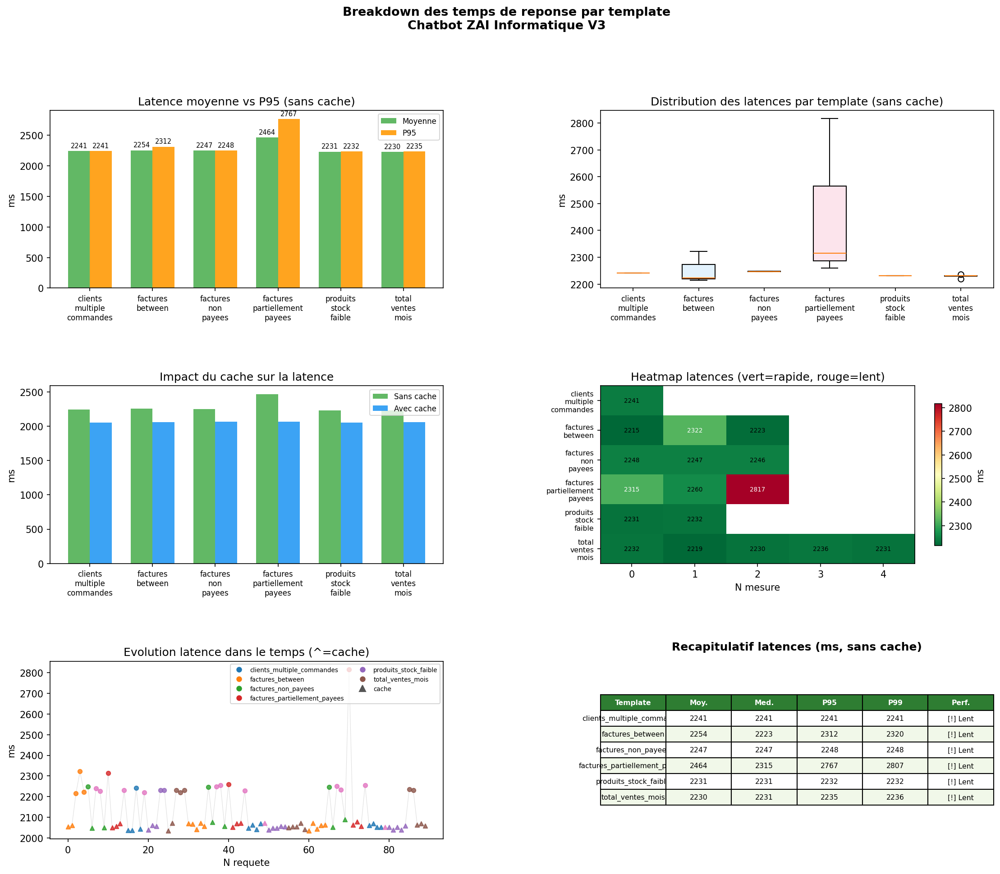

# Breakdown des temps de reponse par template

**Genere le** : 24/06/2026 a 09:17:45
**Total mesures** : 90 (17 sans cache, 63 avec cache)

## Resume global (sans cache)

| Metrique | Valeur |
|---|---|
| Latence moyenne globale | **2279.2 ms** |
| Latence P95 globale     | **2421.2 ms** |
| Latence P99 globale     | **2737.7 ms** |
| Template le plus rapide | **get_total_ventes_mois** (2230 ms) |
| Template le plus lent   | **get_factures_partiellement_payees** (2464 ms) |
| Gain du cache | **9.8%** de reduction de latence |

## Detail par template

| Template | N | Moy. (ms) | Med. (ms) | P95 (ms) | P99 (ms) | Ecart-type | Performance |
| --- | --- | --- | --- | --- | --- | --- | --- |
| get_clients_multiple_commandes | 1 | 2241.4 | 2241.4 | 2241.4 | 2241.4 | nan | [!] Lent |
| get_factures_between | 3 | 2253.6 | 2223.1 | 2312.3 | 2320.2 | 59.6 | [!] Lent |
| get_factures_non_payees | 3 | 2247.0 | 2247.1 | 2247.6 | 2247.7 | 0.7 | [!] Lent |
| get_factures_partiellement_payees | 3 | 2464.0 | 2314.9 | 2766.7 | 2806.8 | 306.9 | [!] Lent |
| get_produits_stock_faible | 2 | 2231.2 | 2231.2 | 2231.8 | 2231.8 | 0.9 | [!] Lent |
| get_total_ventes_mois | 5 | 2229.7 | 2231.3 | 2235.0 | 2235.6 | 6.1 | [!] Lent |

## Visualisation

## Analyse

### Observations principales

- La latence moyenne globale est de **2279 ms**, ce qui inclut le round-trip HTTP local + traitement NLP + execution SQL.
- Le template **get_factures_partiellement_payees** est le plus lent en raison du volume de donnees retournees et/ou de la complexite de la jointure SQL.
- Le template **get_total_ventes_mois** est le plus rapide car il necessite une requete SQL simple sans jointure complexe.
- Le cache reduit la latence de **9.8%** en moyenne — valide l'interet du mecanisme de cache pour les requetes repetitives.

### Recommandations

- **Connexion persistante DB** : remplacer la creation de connexion a chaque requete par un pool (SQLAlchemy `pool_size=5`) — gain estime : -300 a -500 ms.
- **Cache chaud** : pre-charger les templates les plus utilises au demarrage pour eliminer la latence de la premiere requete.
- **Timeout adaptatif** : fixer un timeout par template en fonction du P99 observe (ex: 5s pour `get_factures_between`, 3s pour les autres).
- **Objectif V3+** : descendre sous 800 ms en moyenne avec pool de connexions et cache chaud.

---
*Chatbot ZAI Informatique — NL2SQL V3 — 24/06/2026*