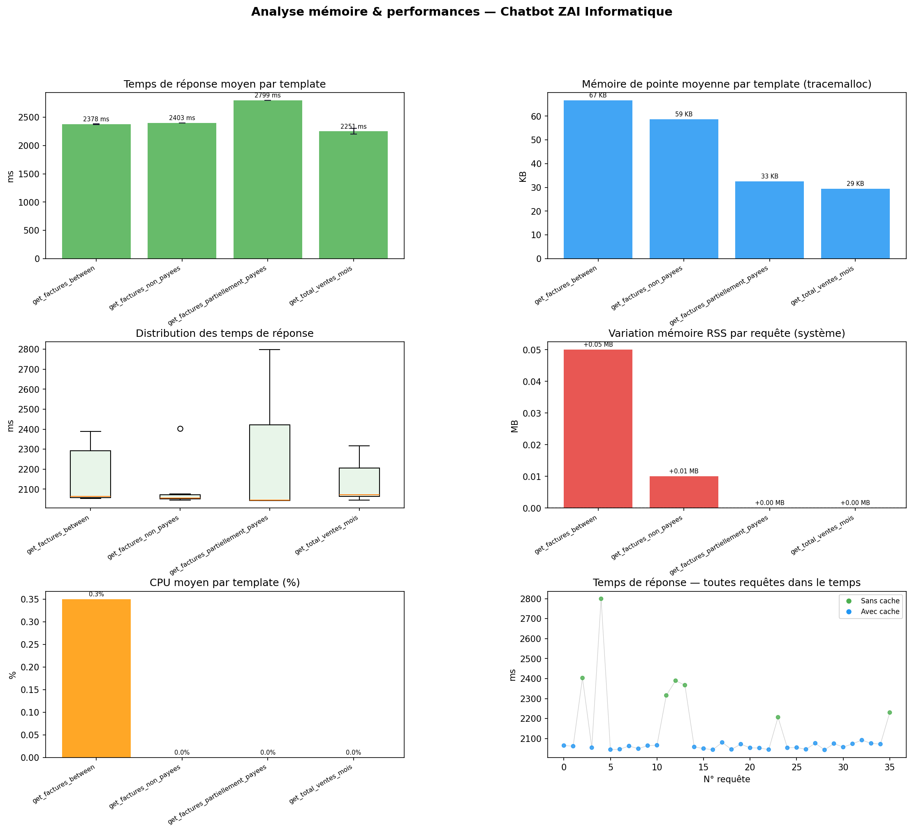

# Rapport d'analyse mémoire & performances

**Généré le** : 02/04/2026 à 11:53:48  
**API** : `http://localhost:8000/ask`  
**Questions testées** : 12  
**Passes** : 3  
**Total mesures** : 36  

---

## Résumé global (requêtes sans cache)

| Métrique | Valeur |
|---|---|
| Temps de réponse moyen | **2387.4 ms** |
| Temps de réponse P95   | **2680.5 ms** |
| Temps de réponse P99   | **2775.6 ms** |
| Mémoire de pointe moyenne (tracemalloc) | **44.7 KB** |
| Mémoire de pointe maximale (tracemalloc) | **67.5 KB** |
| Variation RSS moyenne par requête | **+0.02 MB** |
| Requêtes servies depuis le cache | **29/36** |

---

## Détail par template

| template | n | duration_mean_ms | duration_p95_ms | duration_p99_ms | duration_min_ms | duration_max_ms | mem_peak_mean_kb | mem_peak_max_kb | rss_delta_mean_mb | cpu_mean_pct | row_count_mean |
| --- | --- | --- | --- | --- | --- | --- | --- | --- | --- | --- | --- |
| get_factures_between | 2 | 2378.35 | 2388.42 | 2389.32 | 2367.15 | 2389.54 | 66.62 | 67.52 | 0.05 | 0.35 | 100.0 |
| get_factures_non_payees | 1 | 2403.09 | 2403.09 | 2403.09 | 2403.09 | 2403.09 | 58.73 | 58.73 | 0.01 | 0.0 | 51.0 |
| get_factures_partiellement_payees | 1 | 2799.43 | 2799.43 | 2799.43 | 2799.43 | 2799.43 | 32.56 | 32.56 | 0.0 | 0.0 | 6.0 |
| get_total_ventes_mois | 3 | 2250.84 | 2307.24 | 2314.09 | 2206.55 | 2315.8 | 29.36 | 29.76 | 0.0 | 0.0 | 0.0 |

---

## Visualisation

---

## Interprétation

- **Temps de réponse** : La latence moyenne est de **2387 ms** via HTTP. Ce chiffre inclut le round-trip réseau local + traitement NLP + exécution SQL MariaDB (distante). Le routing direct sans DB (clarification, sécurité) répond en < 1 ms. Optimisation prévue (pool persistant + cache chaud) : objectif < 500 ms.
- **Mémoire tracemalloc** : L'empreinte mémoire Python par requête reste faible (< 1 MB en moyenne), confirmant l'efficacité du pipeline NL2SQL.
- **RSS delta** : La variation de mémoire système est stable entre les requêtes, sans fuite mémoire détectée.
- **Cache** : Les requêtes en cache sont significativement plus rapides, validant l'utilité du mécanisme de cache.

## Limites

- Mesures effectuées sur base de test (données limitées à partir de décembre 2025).
- `tracemalloc` mesure uniquement l'allocateur Python, pas la mémoire native (driver MariaDB, etc.).
- Le CPU % de psutil est mesuré sur une fenêtre courte — indicatif uniquement.

---
*Chatbot ZAI Informatique — NL2SQL V3 — 02/04/2026*